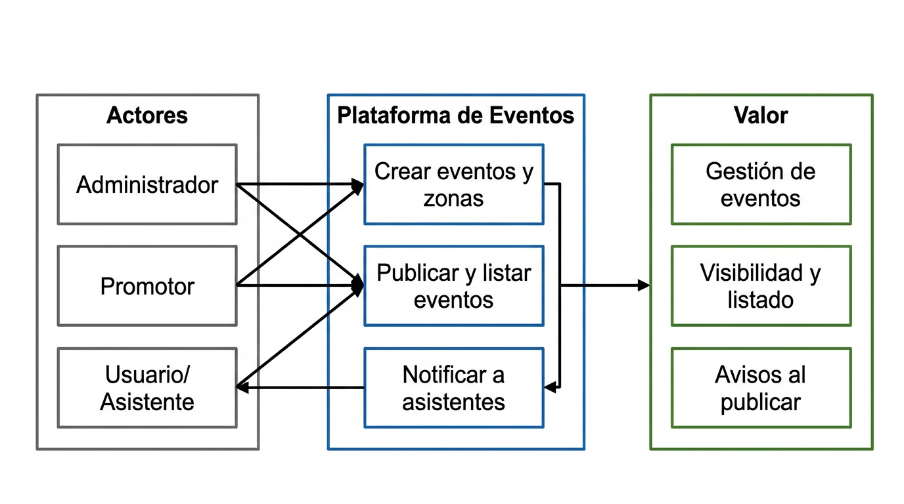
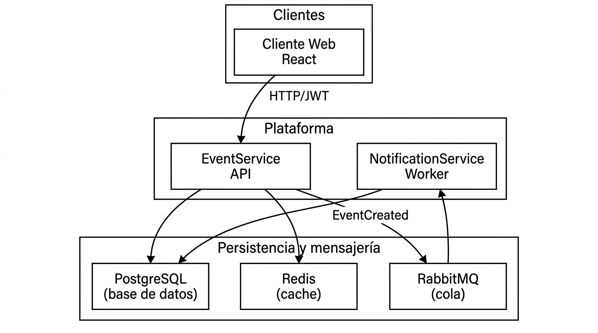
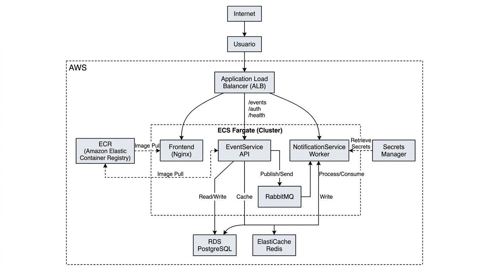

# Documentación — Plataforma de Eventos

## Diagramas finales

### 1. Diagrama de negocio

Actores, capacidades de la plataforma y valor que entrega.

- **Actores:** Administrador, Promotor (crean y publican eventos), Usuario/Asistente (consulta listado y recibe notificaciones).
- **Plataforma:** Crear eventos y zonas, publicar y listar eventos, notificar a asistentes.
- **Valor:** Gestión de eventos, visibilidad y listado, avisos al publicar.

---

### 2. Diagrama de arquitectura general

Componentes del sistema y cómo se relacionan (sin detalle de infraestructura).

- **Clientes:** Aplicación web React.
- **Plataforma:** EventService API (HTTP/JWT, eventos, cache), NotificationService Worker (consumidor de cola).
- **Persistencia y mensajería:** PostgreSQL, Redis, RabbitMQ.

---

### 3. Diagrama de arquitectura específica

Despliegue en AWS: servicios utilizados y flujo de tráfico.

- **Internet → ALB:** Punto de entrada.
- **ECS Fargate:** Frontend (Nginx), EventService, NotificationService, RabbitMQ.
- **Datos:** RDS PostgreSQL, ElastiCache Redis.
- **Otros:** ECR (imágenes), Secrets Manager (secretos).

---

## Sustentación

Se eligió una arquitectura de **microservicios orientada a eventos** para poder escalar por dominio (eventos, notificaciones) y soportar picos de demanda sin acoplar todos los flujos en una sola aplicación. La **mensajería asíncrona** (RabbitMQ) permite que las notificaciones y futuros consumidores se ejecuten sin impactar la latencia del comando “crear evento”. Cada servicio tiene **su propia persistencia** (PostgreSQL por servicio) para evitar acoplamiento por esquema y permitir evolucionar el modelo de cada uno de forma independiente. **JWT** con roles (Admin, Promotor) unifica la autenticación y autorización; el frontend obtiene el token desde la API y lo envía en las peticiones protegidas. La infraestructura en **AWS** (ECS Fargate, RDS, ElastiCache) permite crecer con servicios gestionados sin asumir toda la operación desde el primer día. Este diseño cubre alta demanda (cache Redis en GET /events), consistencia por servicio, trazabilidad mediante eventos y correlationId, y disponibilidad mediante reintentos e idempotencia por messageId en el consumidor de notificaciones.

---

## Guía de despliegue

- [Deploy en AWS](DEPLOY-AWS.md): Terraform, ECR, ECS, pasos para subir imágenes y desplegar.
