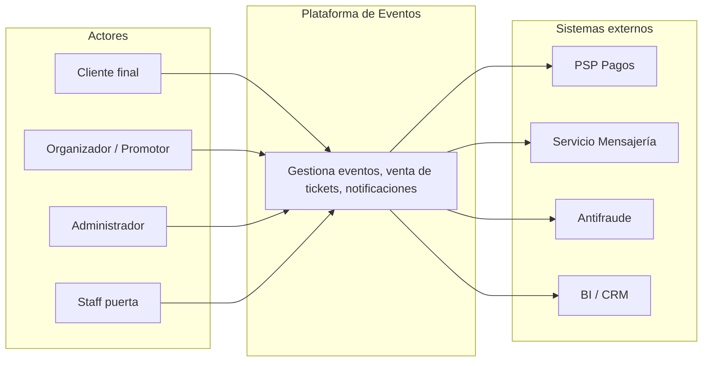
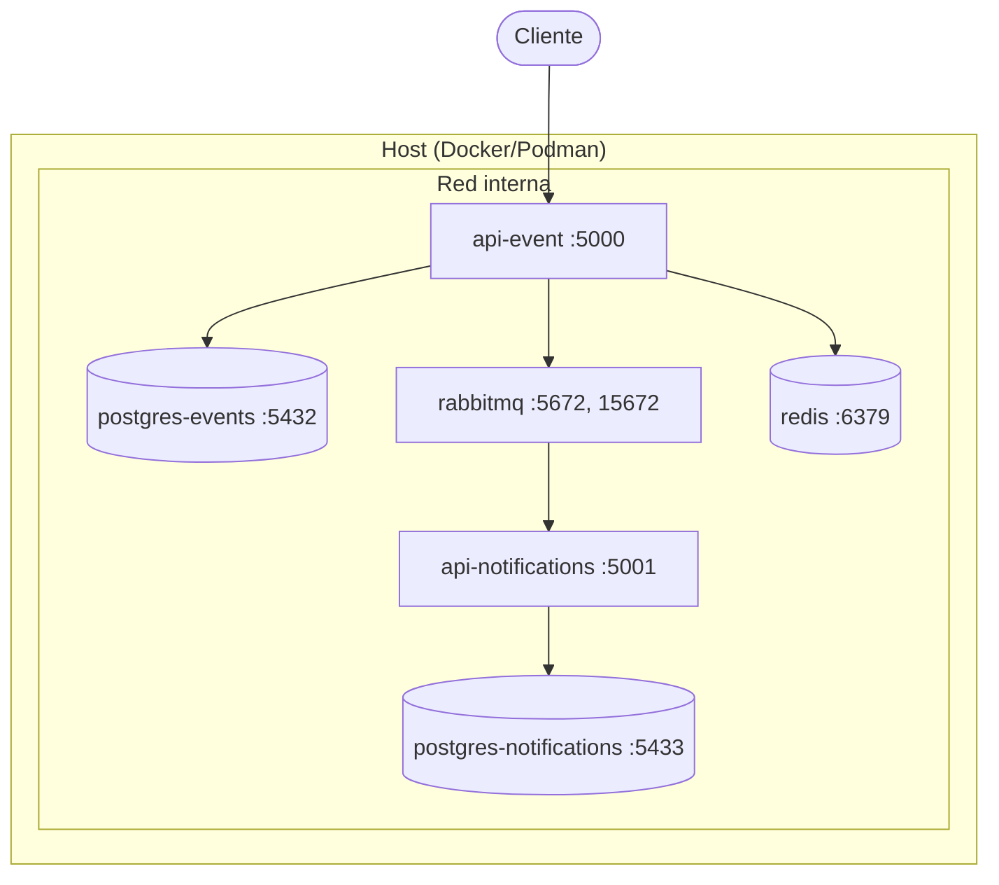
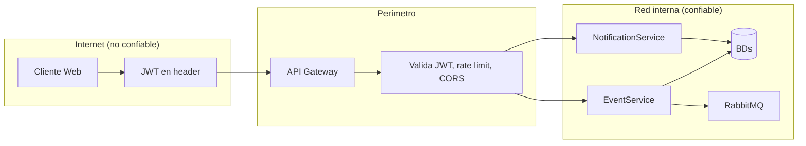
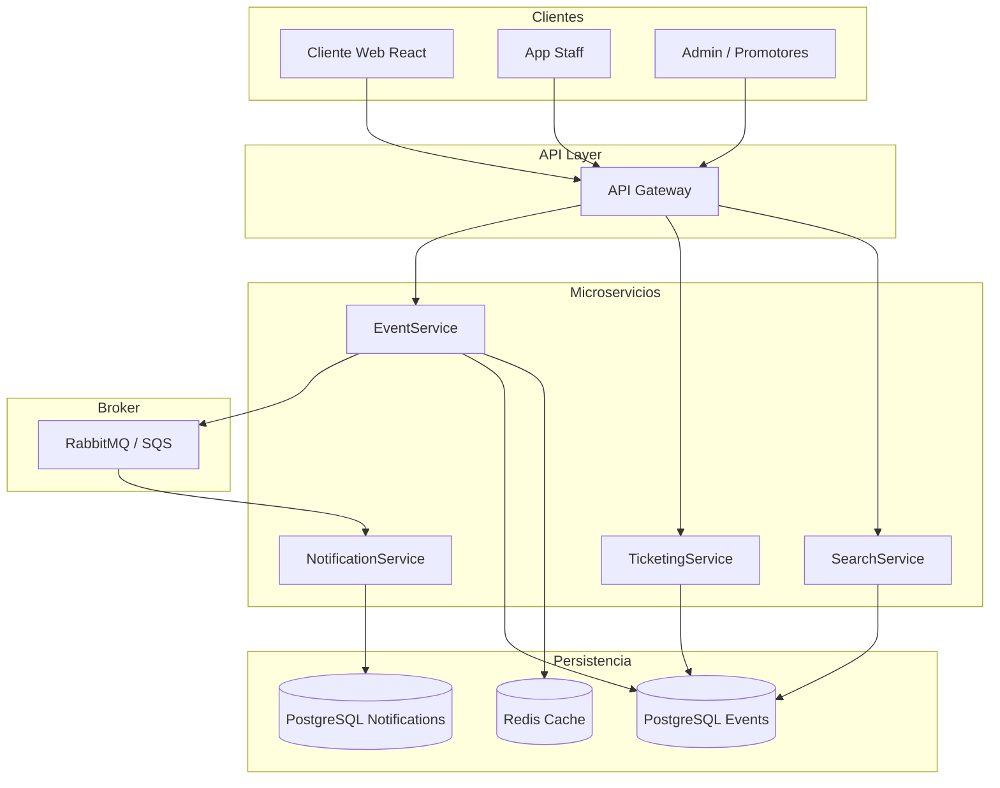
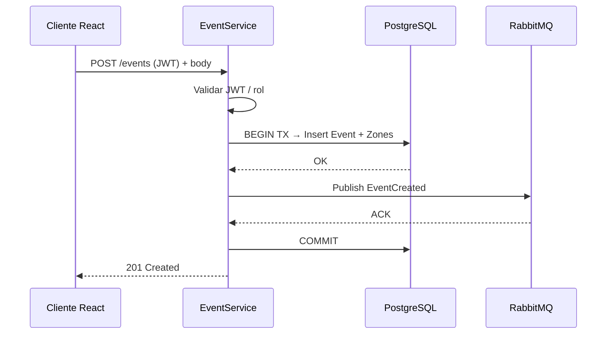
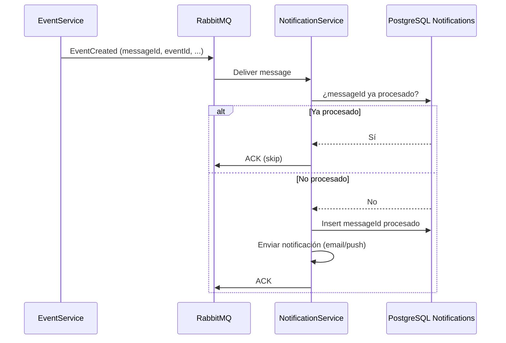
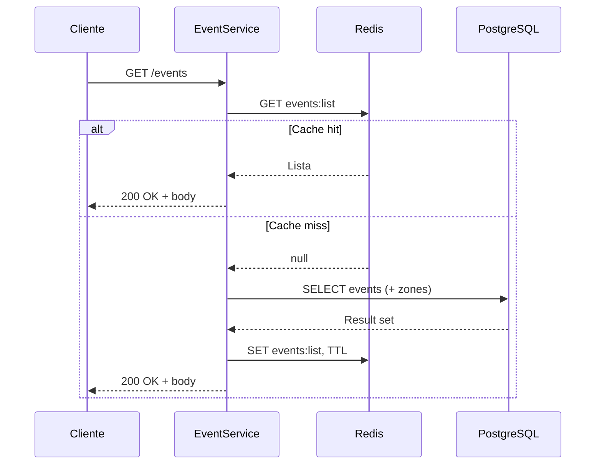
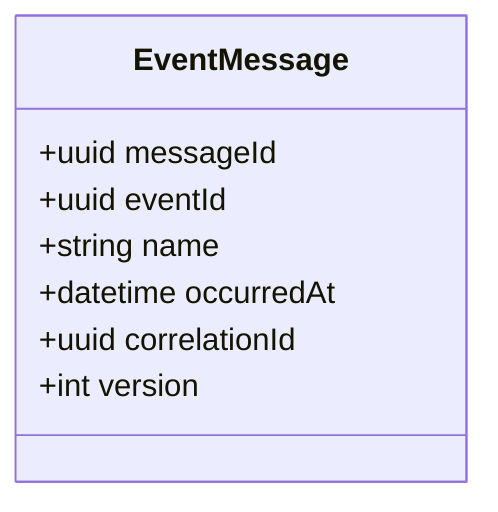
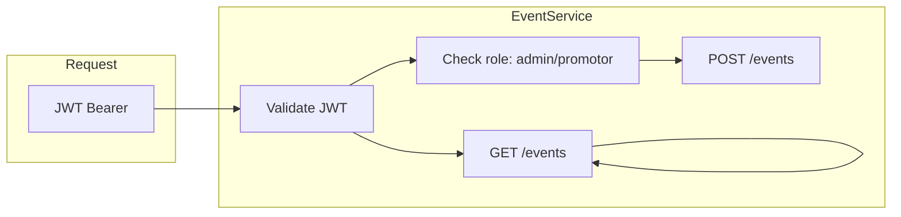

# Diagramas de arquitectura — Mermaid

Estos diagramas se pueden visualizar en GitHub, en [Mermaid Live](https://mermaid.live) o en cualquier visor que soporte Mermaid.  
Incluyen vistas de **contexto (C4)**, **despliegue**, **seguridad** y **resiliencia**.

---

## 1. C4 Nivel 1 — Contexto del sistema

El sistema en el mundo: actores que lo usan y sistemas externos con los que se integra.



---

## 2. Vista de despliegue — MVP (Docker / Podman)

Contenedores y conexiones en el entorno local del MVP.



---

## 3. Límites de seguridad (trust zones)

Dónde se valida la identidad y la autorización.



---

## 4. Componentes y microservicios (alto nivel)



---

## 5. Flujo síncrono — Crear evento (POST /events)



---

## 6. Flujo POST /events — Rama de error y resiliencia

Si la BD falla: ROLLBACK y 5xx. Si el broker falla: reintento y opcional DLQ o Outbox.

```mermaid
sequenceDiagram
    participant C as Cliente React
    participant ES as EventService
    participant DB as PostgreSQL
    participant MQ as RabbitMQ

    C->>ES: POST /events
    ES->>DB: BEGIN TX, Insert Event+Zones
    alt OK
        DB-->>ES: OK
        ES->>MQ: Publish EventCreated
        alt ACK
            MQ-->>ES: ACK
            ES->>DB: COMMIT
            ES-->>C: 201 Created
        else Fallo broker
            MQ-->>ES: Error / timeout
            Note over ES: Retry 3x; si falla: Outbox o DLQ
            ES->>DB: COMMIT
            ES-->>C: 201 Created (mensaje se reenvía después)
        end
    else Fallo BD
        DB-->>ES: Error
        ES->>DB: ROLLBACK
        ES-->>C: 500 Internal Server Error
    end
```

---

## 7. Flujo asíncrono — EventCreated → NotificationService



---

## 8. Flujo síncrono — Listar eventos (GET /events) con cache



---

## 9. Contrato de mensaje (referencia)



---

## 10. Seguridad — Boundaries y JWT



- **POST /events:** requiere JWT y rol admin o promotor.
- **GET /events:** puede ser público o con JWT según política.

---

*Generado para docs/architecture.md — Plataforma de Eventos*
